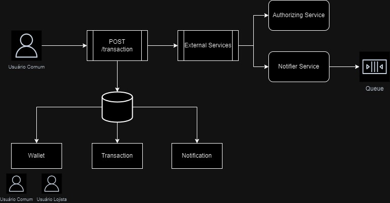

# Desafio Backend - Picpay Simplificado

### Esse projeto foi desenvolvido para solucionar esse [desafio]("https://github.com/PicPay/picpay-desafio-backend?tab=readme-ov-file"), que consiste em criar um Picpay Simplificado.

## Tecnologias Utilizadas

- FastAPI
- Apache Kafka
- Docker Compose
- MySQL

## Arquitetura

